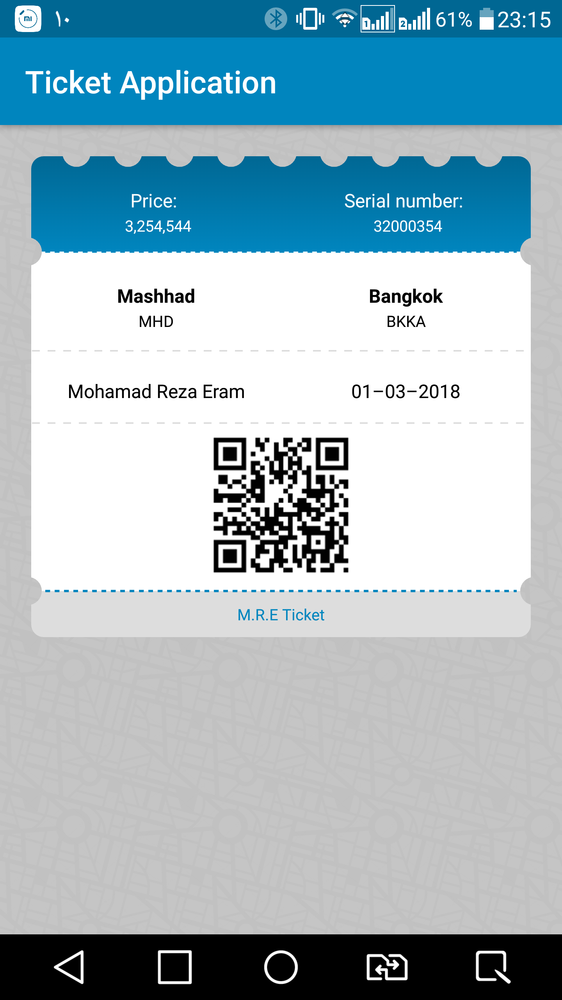

# TicketView
A custom view for tickets

<p align="center">

</p>

## How to use:question:
  ```
  <com.mreram.ticketview.TicketView
        android:layout_width ="match_parent"
        android:layout_height="wrap_content"
        app:tv_anchor1="@+id/cl_head"
        app:tv_anchor2="@+id/cl_center"
        app:tv_circleSpace="15dp"
        app:tv_dashSize="1.5dp"
        app:tv_dashColor="@color/colorPrimary"
        app:tv_circleRadius="9dp">

      //todo adding your views

  </com.mreram.ticketview.TicketView>
```

## Attributes

| Name | Description |
| ------ | ------ |
| tv_circleRadius(optional) | radius of circle |
| tv_dashSize(optional) | dash size |
| tv_dashColor(optional) | dash color |
| tv_circleSpace(optional) | space between top circles |
| tv_anchor1 | determines where separator is drawn |
| tv_anchor2(optional) | determines where separator is drawn |


## Contribution :collision:

Pull requests are welcome! :clap:

You can improve/fix some part of it .

Add Tests:

Assuming that the code in question already has automated (unit) tests, do add tests for the code you submit.
This isn't a hard rule. There are various cases where you may need to add code without test coverage (e.g. when adding a Object), but if it can be tested, it should be tested.


## License
```
   Copyright 2018 Mohammad Reza Eram

   Licensed under the Apache License, Version 2.0 (the "License");
   you may not use this file except in compliance with the License.
   You may obtain a copy of the License at

       http://www.apache.org/licenses/LICENSE-2.0

   Unless required by applicable law or agreed to in writing, software
   distributed under the License is distributed on an "AS IS" BASIS,
   WITHOUT WARRANTIES OR CONDITIONS OF ANY KIND, either express or implied.
   See the License for the specific language governing permissions and
   limitations under the License.